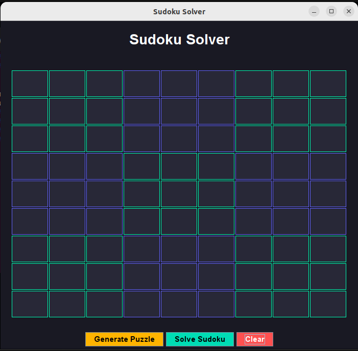
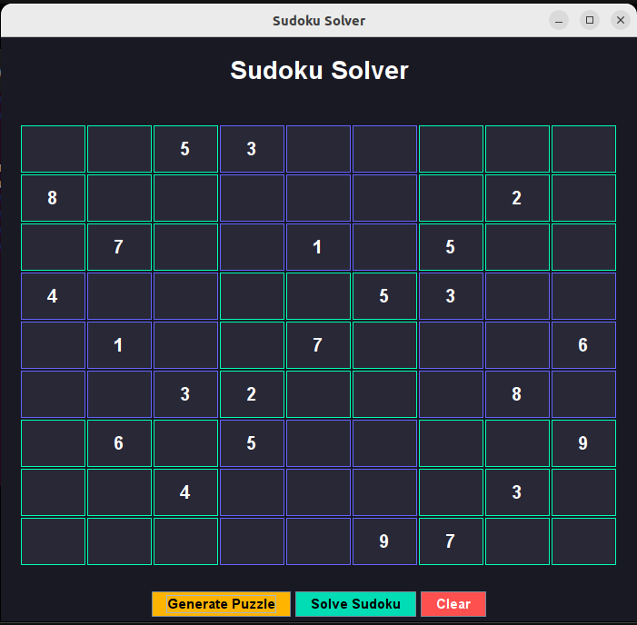
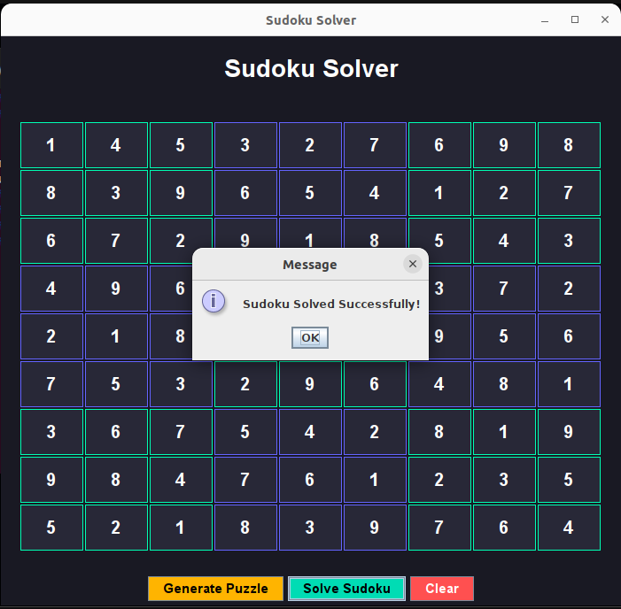

# 🧩 Sudoku Solver - Java GUI Project

A Java Swing-based Sudoku Solver application that allows users to generate Sudoku puzzles, solve them automatically, and clear/reset the board through an interactive graphical user interface.

This project was developed as **Task 3** of my **Software Development Internship at SkillCraft Technology**.

---

## 📌 Project Overview

The application provides a user-friendly Sudoku interface where users can:

- Generate a Sudoku puzzle randomly from a dataset of 20 valid puzzles
- Solve the puzzle automatically using an algorithm
- Clear the board and start again
- Interact with a clean dark-themed GUI

The solver uses the **Backtracking Algorithm** to efficiently fill empty cells while following Sudoku rules.

---

## ✨ Features

✅ Interactive Java Swing GUI  
✅ Dark Theme UI Design  
✅ Random Puzzle Generation (20 predefined puzzles)  
✅ Automatic Sudoku Solving  
✅ Clear / Reset Functionality  
✅ Input Validation (only valid numbers allowed)  
✅ Popup messages for success / invalid inputs  

---

## 🛠 Tech Stack

- **Java**
- **Java Swing**
- **Object-Oriented Programming (OOP)**
- **Backtracking Algorithm**
- **Git & GitHub**

---

## 🧠 Algorithm Used

### Backtracking Algorithm

The Sudoku solver works using recursion and backtracking:

1. Find an empty cell (`0`)
2. Try numbers from **1 to 9**
3. Check whether the number is valid:
   - Row check
   - Column check
   - 3×3 grid check
4. If valid → place the number
5. Recursively solve remaining cells
6. If no number works → backtrack

This process continues until the entire Sudoku board is solved.

---

## 📂 Project Structure

```bash
Sudoku-Solver/
│
├── Main.java
├── SudokuSolver.java
├── SudokuPuzzles.java
│
└── output/
    ├── Homescreen.png
    ├── output1.png
    └── output2.png
```

---

## 📸 Output Screenshots

### 🏠 Home Screen
Shows the main Sudoku interface with Generate, Solve, and Clear buttons.

<p align="center">
  
</p>

---

### 🎲 Generated Puzzle
Loads a random Sudoku puzzle from the dataset.

<p align="center">
  
</p>

---

### ✅ Solved Puzzle
Displays the solved Sudoku grid after applying the Backtracking Algorithm.

<p align="center">
  
</p>

---

## 🚀 What I Learned

Through this project, I improved my understanding of:

- Java GUI Development using Swing
- Event Handling
- Problem Solving
- Recursion & Backtracking
- Writing clean modular code
- Project structuring using multiple Java files

---

## 🔮 Future Improvements

- True Random Sudoku Generator
- Difficulty Levels (Easy / Medium / Hard)
- Timer Feature
- Score Tracking
- Better UI Styling

---

## 🏢 Internship Task

**Task 3 – Build a Sudoku Solver**

Requirement:

> Create a program that solves Sudoku puzzles automatically.  
> The program should take an input grid representing an unsolved Sudoku puzzle and use an algorithm to fill in the missing numbers.

---

## 👩‍💻 Author

**Kommireddy Neelamrutha**  

---

